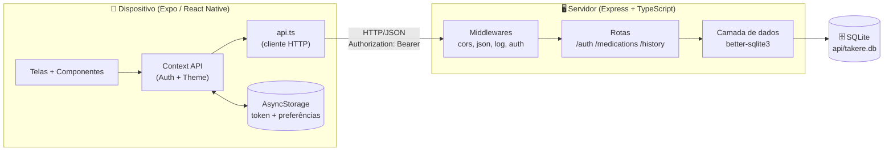
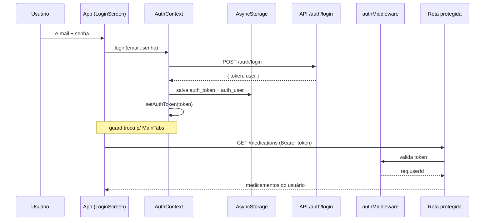
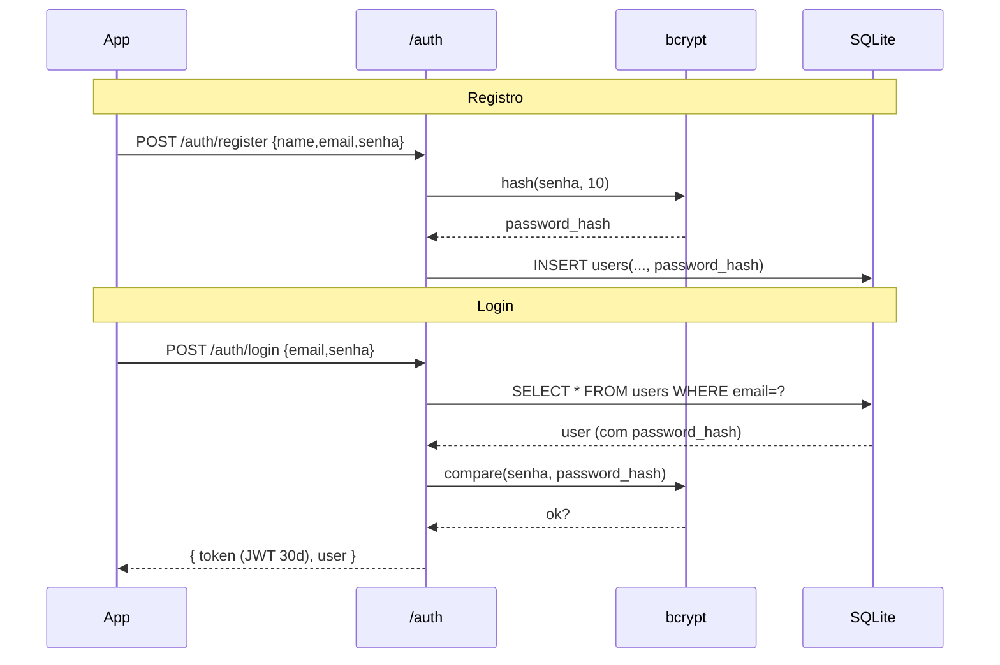
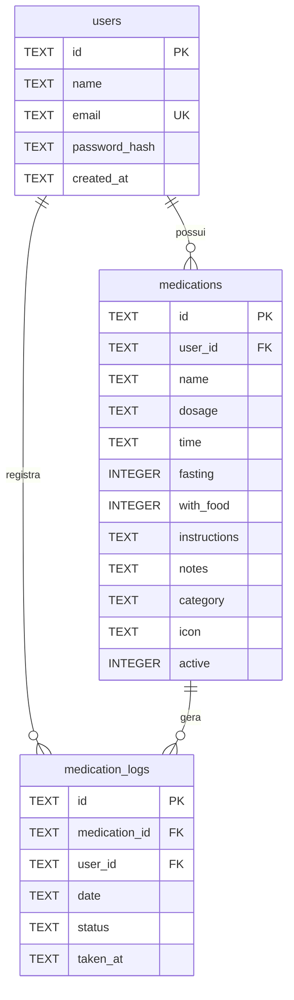

# Arquitetura do Takere

Documento técnico de arquitetura do **Takere**, app pessoal de acompanhamento de
medicamentos. Escrito como referência para a redação e a defesa do TCC.

> Este documento descreve **o que está efetivamente implementado no código** na data de
> escrita. Funcionalidades de roadmap (cadastro/edição de medicamento, exportação, biometria
> etc.) são apenas referenciadas na seção [Estado atual e limitações](#10-estado-atual-e-limitações).

---

## 1. TL;DR

- **O que é:** aplicativo mobile para uma pessoa registrar e acompanhar a tomada dos próprios
  medicamentos ao longo do dia, com histórico de aderência.
- **Stack em uma frase:** front em **React Native + Expo + TypeScript**; back em
  **Express 5 + SQLite (better-sqlite3) + TypeScript**.
- **Como as duas partes conversam:** o app faz chamadas **HTTP/JSON** para a API na rede local
  (LAN); a autenticação usa **JWT** enviado no cabeçalho `Authorization: Bearer <token>`.
- **Telas implementadas:** Login, **Hoje** (medicamentos do dia) e **Histórico** (aderência dos
  últimos 7 dias).
- **Senhas:** nunca são guardadas em texto puro — apenas o **hash bcrypt** (fator de custo 10).
- **Persistência:** no backend, um arquivo **SQLite** (`api/takere.db`); no app, **AsyncStorage**
  guarda o token de sessão e preferências (tema).
- **Monorepo:** `src/` (app) e `api/` (servidor) são independentes — não compartilham código, e
  o `api/` pode ser removido sem quebrar o front.

**Endpoints da API:**

| Método | Rota | Autenticada? | Função |
|---|---|---|---|
| `POST` | `/auth/register` | Não | Cria usuário (hash da senha) |
| `POST` | `/auth/login` | Não | Valida credenciais e devolve o JWT |
| `GET` | `/medications` | Sim | Medicamentos de hoje com status |
| `PATCH` | `/medications/:id/status` | Sim | Marca um medicamento como tomado/atrasado/pendente |
| `GET` | `/history` | Sim | Aderência dos últimos 7 dias |
| `GET` | `/health` | Não | Checagem de que o servidor está no ar |

---

## 2. Visão geral da arquitetura

O sistema tem dois processos independentes: o **app mobile** (rodando no celular ou no
simulador) e o **servidor de API** (rodando em uma máquina na mesma rede). A comunicação é
sempre iniciada pelo app, via HTTP. O servidor é a única coisa que toca o banco de dados.



**Estrutura do monorepo** (pastas principais):

```
takere-interface/
├── App.tsx          # ponto de entrada da navegação + guard de auth
├── index.ts         # registra o App no runtime do Expo
├── src/             # FRONTEND (React Native / Expo)
│   ├── screens/     #   Login, Home (Hoje), History (Histórico)
│   ├── components/  #   cards, calendário, snackbar etc.
│   ├── context/     #   AuthContext, ThemeContext
│   ├── services/    #   api.ts (HTTP), notifications.ts
│   ├── data/        #   tipos TypeScript e cálculos de aderência
│   └── theme/       #   paleta de cores e design tokens
└── api/             # BACKEND (Express + SQLite) — isolado e removível
    └── src/
        ├── index.ts     # bootstrap do servidor
        ├── db/          # database.ts, migrate.ts, seed.ts
        ├── routes/      # auth.ts, medications.ts, history.ts
        ├── middleware/  # auth.ts (verificação do JWT)
        └── types/       # interfaces das linhas do banco e respostas
```

Decisão de projeto: o diretório `api/` é **intencionalmente isolado**. Não há nenhum `import`
cruzado entre `src/` e `api/`; os tipos são declarados duas vezes (um lado em
`src/data/medications.ts`, o outro em `api/src/types/index.ts`). Isso mantém o back como uma
peça descartável/substituível.

---

## 3. Frontend — como o app é montado

### Stack

- **React Native 0.81** sobre **Expo 54** (gerenciado), **React 19**, **TypeScript**.
- **React Navigation** para navegação: *bottom tabs* + *native stack*.
- **AsyncStorage** para persistência local.
- **expo-notifications** para lembretes locais.
- Sem biblioteca de gerência de estado — apenas a **Context API** do React.

### Ponto de entrada e árvore de providers

O Expo registra o `App` via `index.ts` → `registerRootComponent(App)`. O `App.tsx` monta a
árvore de contexto na seguinte ordem (de fora para dentro):

```
SafeAreaProvider
└── ThemeProvider          (tema claro/escuro)
    └── AuthProvider        (estado de autenticação)
        └── AppNavigator    (decide quais telas mostrar)
```

### Guard de autenticação

`AppNavigator` (em `App.tsx`) é o que decide o que o usuário vê, com base no `token` do
`AuthContext`:

- enquanto `isLoading` for `true` (estamos lendo o token salvo no AsyncStorage), mostra um
  *spinner* de tela cheia;
- se existe `token` → renderiza `MainTabs` (as abas **Hoje** e **Histórico**);
- se não há `token` → renderiza o `AuthStack` (tela de **Login**).

Ou seja, não há rota "protegida" no sentido tradicional: a própria árvore de navegação muda
conforme o usuário está logado ou não. Ao fazer logout, o `token` vira `null` e a navegação
volta automaticamente para o Login.

### Gerência de estado (Context API)

Dois contextos, ambos pequenos e focados:

- **`AuthContext`** (`src/context/AuthContext.tsx`) — expõe `token`, `user`, `isLoading`,
  `login(email, senha)` e `logout()`. No *boot* do app, um `useEffect` lê `auth_token` e
  `auth_user` do AsyncStorage (`multiGet`); se ambos existem, restaura a sessão e injeta o token
  no cliente HTTP via `setAuthToken`. Isso é o que mantém o usuário logado entre aberturas do app.
- **`ThemeContext`** (`src/context/ThemeContext.tsx`) — fornece a paleta de cores ativa
  (`colors`), o booleano `isDark` e `toggleTheme()`. Por padrão respeita o tema do sistema
  (`useColorScheme`); um *override* manual é persistido em `theme_override`.

### Telas (`src/screens/`)

- **LoginScreen** — formulário de e-mail/senha. Chama `login()` do `AuthContext`, exibe estado
  de carregamento e mensagens de erro. Em caso de sucesso, o guard de auth troca a navegação.
- **HomeScreen ("Hoje")** — a tela central. Busca `/medications` ao focar (`useFocusEffect`) e:
  - calcula o resumo do dia (tomados / atrasados / pendentes) e renderiza o `DaySummary`;
  - agrupa os medicamentos por período (**Manhã** 6–11h, **Tarde** 12–17h, **Noite** 18–23h);
  - oferece filtros por status (Todos / Tomados / Atrasados / Pendentes);
  - destaca o "próximo medicamento" e quanto falta para o horário;
  - permite marcar como tomado com **atualização otimista** + **UndoSnackbar** (desfazer);
  - suporta **pull-to-refresh**.
- **HistoryScreen ("Histórico")** — busca `/history` e mostra a **aderência semanal**
  (percentual), um **calendário dos últimos 7 dias** (`WeekCalendar`) selecionável, e a lista de
  medicamentos do dia escolhido com seus status.

### Componentes (`src/components/`)

`MedicationCard` (card expansível com instruções e botão "marcar como tomado"), `DaySummary`
(estatísticas + barra de progresso), `WeekCalendar` (barras de aderência por dia),
`SectionHeader` (cabeçalho de cada período) e `UndoSnackbar` (aviso animado com ação de
desfazer). Todos consomem `useTheme()` para se adaptarem ao modo claro/escuro.

### Design tokens (`src/theme/index.ts`)

Centraliza `lightColors` / `darkColors`, além de `spacing`, `radius` e `typography`. O padrão em
todo o app é uma função `makeStyles(colors)` chamada dentro de `useMemo` — assim os estilos são
recalculados quando o tema muda.

### Notificações locais (`src/services/notifications.ts`)

Usa **expo-notifications** para agendar um lembrete **diário** no horário de cada medicamento
(`SchedulableTriggerInputTypes.DAILY`). Os IDs das notificações agendadas são guardados em
`notification_ids` no AsyncStorage para permitir cancelamento. Há uma ressalva tratada em
código: o **Expo Go não suporta** notificações agendadas no iOS, e nesse caso o app exibe um
alerta explicando que é preciso uma *development build*.

### Chaves do AsyncStorage

| Chave | Conteúdo |
|---|---|
| `auth_token` | JWT da sessão |
| `auth_user` | JSON do usuário logado (`id`, `name`, `email`) |
| `theme_override` | `'light'` / `'dark'` quando o usuário força um tema |
| `notification_ids` | mapa `medicationId → notificationId` |

---

## 4. Cliente HTTP e integração com o backend

Toda a comunicação com a API passa por um único módulo: **`src/services/api.ts`**. É um wrapper
fino sobre o `fetch` que centraliza três responsabilidades:

1. **Base URL** — `API_BASE_URL` está fixo no **IP da máquina na LAN** (ex.: `http://192.168.15.10:3000`).

   > **Por que não `localhost`?** Em um simulador/emulador (ou celular físico), `localhost`
   > aponta para o próprio dispositivo, não para o computador que roda a API. Por isso usa-se o
   > IP da rede local. (No emulador Android, a alternativa é o alias `10.0.2.2`.)

2. **Autenticação** — o token fica em uma variável de módulo (`authToken`), definida via
   `setAuthToken()` no login/restauração de sessão. Quando presente, toda requisição recebe o
   cabeçalho `Authorization: Bearer <token>`.

3. **Robustez e erros** — cada chamada tem **timeout de 10 segundos** (via `AbortController`),
   sempre envia `Content-Type: application/json`, e normaliza erros: se a resposta não for
   `ok`, lança um `Error` com a mensagem `error` devolvida pela API.

A API exposta ao resto do app é mínima: `api.get`, `api.post` e `api.patch`.

### Conversão de formato (snake_case ↔ camelCase)

O banco e o backend usam **snake_case** (`with_food`, `taken_at`), enquanto o front usa
**camelCase** (`withFood`, `takenAt`). A tradução acontece **no backend**, na função
`toMedicationResponse` (`api/src/routes/medications.ts`), que monta o objeto de resposta no
formato que o front espera. O app, portanto, nunca lida com nomes de coluna do banco.

### Atualização otimista

Ao marcar um medicamento como tomado, `HomeScreen.handleMarkTaken` **atualiza a UI primeiro**
(muda o status localmente e mostra o snackbar) e só depois dispara o `PATCH`. Se a requisição
falhar, a falha é silenciosa — a alteração otimista permanece. O `handleUndo` faz o caminho
inverso. Essa escolha prioriza a sensação de resposta imediata, adequada a um app de uso pessoal.

### Fluxo de uma sessão autenticada



---

## 5. Backend — com o que se comunica e como funciona

### Stack

- **Express 5** + **TypeScript** (executado em desenvolvimento com `ts-node-dev`).
- **better-sqlite3** — driver SQLite **síncrono**, usado **sem ORM**: consultas escritas
  diretamente com `db.prepare(...).get/all/run()`.
- **jsonwebtoken** (JWT), **bcrypt** (hash de senha), **cors**, **dotenv**.

### Bootstrap (`api/src/index.ts`)

Na subida, o servidor:

1. habilita **CORS** (`cors()`) e o parser de **JSON** (`express.json()`);
2. registra um **middleware de log** que imprime `método caminho → status (tempo)` de cada
   requisição;
3. roda as **migrations** (`runMigrations()`) — cria as tabelas se não existirem e popula os
   dados de teste;
4. monta os roteadores em `/auth`, `/medications` e `/history`, mais o `/health`;
5. escuta na porta **3000** (ou `process.env.PORT`).

### Com o que o backend se comunica

- **Para "fora":** apenas com o **app mobile**, via HTTP/JSON. Não há integração com serviços de
  terceiros, fila de mensagens, cache externo ou outro banco.
- **Para "dentro":** com um único **arquivo SQLite local** (`api/takere.db`).

Isto é coerente com a natureza do projeto: o backend é para **uso local/pessoal** e **não é
publicado** na internet.

### Camada de banco (`api/src/db/database.ts`)

Exporta uma **instância singleton** do better-sqlite3. O caminho do arquivo vem de
`process.env.DB_PATH` ou cai no padrão `./takere.db`. O banco roda em **modo WAL**
(`journal_mode = WAL`), que melhora a concorrência de leitura/escrita. O arquivo `.db` (e os
auxiliares `-shm`/`-wal`) são **gitignored**.

### Migrations e seed (`migrate.ts`, `seed.ts`)

- `runMigrations()` executa um bloco de `CREATE TABLE IF NOT EXISTS` para as três tabelas e cria
  o índice único `(medication_id, date)`. Por usar `IF NOT EXISTS`, é seguro rodar a cada boot.
- Em seguida chama `runSeed()`, que insere **3 usuários de teste** com seus medicamentos e
  registros (logs de hoje + dos 6 dias anteriores). O seed é **idempotente**: usa
  `INSERT OR IGNORE` e pula o usuário caso ele já exista, então não duplica dados em reinícios.

Contas criadas pelo seed:

| Email | Senha | Perfil |
|---|---|---|
| `test@test.com` | `test123` | 7 medicamentos, aderência mista |
| `carlos@test.com` | `carlos123` | 5 medicamentos, alta aderência |
| `ana@test.com` | `ana123` | 5 medicamentos, baixa aderência |

---

## 6. Rotas da API (detalhado)

### `POST /auth/register`
Cria um usuário. Valida que `name`, `email` e `password` vieram no corpo; rejeita e-mail já
existente (`409`); gera o hash com `bcrypt.hash(password, 10)`; insere e devolve
`{ id, name, email }`. **Não** devolve token (o usuário precisa fazer login em seguida).

### `POST /auth/login`
Valida `email`/`password`; busca o usuário por e-mail; compara a senha com
`bcrypt.compare(password, user.password_hash)`. Em caso de falha (usuário inexistente ou senha
errada) responde `401` com mensagem genérica ("Credenciais inválidas"). Em caso de sucesso,
assina um **JWT** com payload `{ userId }`, validade **30 dias**, e devolve
`{ token, user: { id, name, email } }`.

### `GET /medications` *(autenticada)*
Devolve os medicamentos **ativos** do usuário com o **status de hoje**. Faz um `LEFT JOIN` da
tabela `medications` com `medication_logs` filtrando pela data de hoje:

```sql
SELECT m.*, l.status, l.taken_at
FROM medications m
LEFT JOIN medication_logs l
  ON l.medication_id = m.id AND l.date = ?      -- hoje
WHERE m.user_id = ? AND m.active = 1
ORDER BY m.time ASC
```

Se ainda **não existe log** para hoje, o status é **calculado dinamicamente** por
`getAutoStatus` (ver abaixo). A resposta já sai em camelCase via `toMedicationResponse`.

### `PATCH /medications/:id/status` *(autenticada)*
Recebe `{ status }` (apenas `taken` | `late` | `pending`). Confere que o medicamento pertence ao
usuário (senão `404`). Faz um **upsert** do log de hoje:

```sql
INSERT INTO medication_logs (id, medication_id, user_id, date, status, taken_at)
VALUES (?, ?, ?, ?, ?, ?)
ON CONFLICT(medication_id, date)
DO UPDATE SET status = excluded.status, taken_at = excluded.taken_at
```

Quando o status é `taken`, grava o horário atual (`HH:MM`) em `taken_at`; caso contrário,
`taken_at` fica nulo.

### `GET /history` *(autenticada)*
Monta os **últimos 7 dias**. Busca todos os medicamentos ativos e todos os logs do período de
uma vez, indexa os logs em um `Map` por `medicationId:data`, e para cada dia × medicamento
resolve o status com a seguinte regra:

- existe log → usa o status do log;
- não existe log e o dia **é anterior a hoje** → assume **`taken`** (preenchimento otimista do
  passado);
- não existe log e o dia **é hoje** → **`pending`**.

### `GET /health`
Devolve `{ ok: true }`. Útil para confirmar rapidamente que o servidor está no ar.

### Lógica de status automático (`getAutoStatus`)
Em `api/src/routes/medications.ts`, para medicamentos sem log no dia: compara o horário agendado
com o horário atual. Se já passaram **mais de 30 minutos** do horário, o status é **`late`**;
caso contrário, **`pending`**.

---

## 7. Autenticação e armazenamento de senhas

Esta é uma seção central para a defesa, então vale detalhar.

### Como as senhas são guardadas

As senhas **nunca** são armazenadas em texto puro. No registro (e no seed), a senha passa por
**bcrypt** com **fator de custo 10** (`bcrypt.hash(password, 10)`), e apenas o resultado é
gravado na coluna `password_hash` da tabela `users`. Características relevantes do bcrypt:

- o **salt** é gerado automaticamente e fica **embutido no próprio hash** — não é preciso uma
  coluna separada;
- é um algoritmo **lento por projeto** (o custo 10 define o número de rounds), o que dificulta
  ataques de força bruta;
- a verificação no login usa `bcrypt.compare(senhaDigitada, hashArmazenado)`, que recalcula o
  hash com o mesmo salt e compara — sem nunca "desfazer" o hash.

### JWT (sessão)

Após validar a senha, o servidor emite um **JWT** assinado com `process.env.JWT_SECRET`. O
payload contém só o `userId`; a validade é de **30 dias**. O app guarda esse token no
AsyncStorage e o reenvia em cada requisição.

> **Nota de segurança (honesta para o TCC):** se `JWT_SECRET` não estiver definido no `.env`, o
> código cai em um segredo padrão (`'fallback-secret'`). Isso é aceitável para um projeto de
> **uso local/pessoal**, mas seria uma falha em produção — em um cenário real, o segredo deveria
> ser obrigatório e o app falhar caso ele esteja ausente. Ver [Decisões de projeto](#9-decisões-de-projeto).

### Verificação em cada requisição (`authMiddleware`)

As rotas `/medications` e `/history` aplicam o `authMiddleware`
(`api/src/middleware/auth.ts`) antes de qualquer lógica. Ele:

1. lê o cabeçalho `Authorization`; se não começar com `Bearer `, responde `401`;
2. extrai o token e o valida com `jwt.verify(token, JWT_SECRET)`;
3. em caso de sucesso, injeta `req.userId` (via *declaration merging* do tipo `Request` do
   Express) e segue;
4. em caso de token inválido/expirado, responde `401`.

Como o `userId` vem do token (e não do corpo da requisição), **todas as consultas filtram por
`user_id`** — um usuário só enxerga e altera os próprios dados.

### Fluxo de ponta a ponta



---

## 8. Modelo de dados

Três tabelas, criadas em `api/src/db/migrate.ts`.



Observações:

- **`users`** — `email` é `UNIQUE`. Booleanos não existem em SQLite, então `fasting`,
  `with_food` e `active` são `INTEGER` (0/1).
- **`medication_logs`** registra **um evento por medicamento por dia**. Há um **índice único**
  `idx_medication_logs_med_date (medication_id, date)` que garante isso e é exatamente o que
  viabiliza o **upsert** (`ON CONFLICT(medication_id, date)`) usado no `PATCH .../status`.
- **`status`** assume `taken` | `late` | `pending`; `taken_at` guarda o horário (`HH:MM`) quando
  o medicamento foi marcado como tomado.

### Da linha do banco ao tipo do front

Os tipos do backend ficam em `api/src/types/index.ts`. A linha crua do banco (`MedicationRow`,
snake_case, com 0/1) é convertida em `MedicationResponse` (camelCase, com `boolean` e campos
opcionais omitidos quando vazios). O front, por sua vez, tem seu próprio tipo equivalente em
`src/data/medications.ts` (`Medication`). São definições **independentes** que combinam por
contrato — coerente com a decisão de manter `api/` desacoplado.

---

## 9. Decisões de projeto

Resumo das escolhas e por que foram feitas — útil para justificar na banca:

- **SQLite + better-sqlite3, sem ORM.** O domínio é pequeno e o uso é local; SQL direto e um
  driver síncrono mantêm o código simples e fácil de ler, sem a curva de uma camada de ORM.
- **Context API em vez de Redux/Zustand.** Só há dois pedaços de estado global (sessão e tema);
  uma biblioteca de estado seria peso desnecessário.
- **`api/` isolado e removível.** Sem código compartilhado entre front e back — facilita
  trocar/remover o backend e deixa a fronteira entre as partes explícita.
- **Dados de teste auto-semeados.** Permite abrir o app e já ter cenários realistas de aderência
  (alta/média/baixa) sem cadastro manual.
- **Atualização otimista com falha silenciosa.** Prioriza resposta imediata da UI; aceitável por
  ser uso pessoal.
- **Backend não publicado (uso local).** Consequência consciente: o `JWT_SECRET` tem fallback,
  o **CORS é aberto** (`cors()` sem restrição de origem) e **não há rate limiting**. São pontos
  que precisariam mudar para um cenário de produção, e estão documentados como tais.

---

## 10. Estado atual e limitações

- **Telas efetivamente implementadas:** Login, Hoje (Home) e Histórico. **Não** existe, no
  código atual, tela de cadastro/edição de medicamento — os medicamentos são criados apenas pelo
  seed do backend.
- **Divergência com o `README.md`:** o README marca itens da "Fase 4" como concluídos (ex.:
  `AddMedicationScreen`, ajuste de tamanho de fonte, vibração com `expo-haptics`, tela de
  detalhes) que **não estão presentes no código**. Este documento reflete o código, não o
  roadmap.
- **Roadmap:** as funcionalidades futuras (streak, relatórios, exportação em PDF/CSV, biometria,
  edição/arquivamento de medicamentos) estão listadas no `README.md` e ficam fora do escopo
  desta arquitetura por ainda não terem implementação.

---

## Apêndice — Como rodar (referência rápida)

```bash
# 1) Backend
cd api
npm install
npm run dev          # ts-node-dev, porta 3000

# 2) Frontend (em outro terminal, na raiz)
npm install
npx expo start
```

Antes de subir o app, ajuste `API_BASE_URL` em `src/services/api.ts` para o IP da sua máquina na
LAN. Detalhes e modo *tunnel* (redes diferentes) estão no `README.md`.
